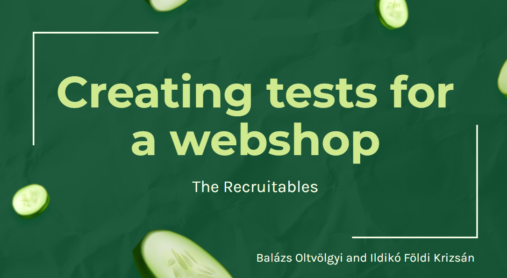

#


[](https://github.com/FoldiKrizsanIldiko)
[](https://github.com/balazs-oltvolgyi)


[](https://www.linkedin.com/in/ildiko-foldi-krizsan/)
[](https://www.linkedin.com/in/balazs-o/)


<br />
<div align="center">
    
<h1 align="center">Offer Oasis Test Project</h1>
  <p align="center">
This project is for testing functionality of Offer Oasis webpage
</p>
</div>

<!-- TABLE OF CONTENTS -->
<details>
  <summary>Table of Contents</summary>
  <ol>
    <li>
      <a href="#about-the-project">About The Project</a>
      <ul>
        <li><a href="#built-with">Built With</a></li>
      </ul>
    </li>
    <li>
      <a href="#getting-started">Getting Started</a>
      <ul>
        <li><a href="#installation">Installation</a></li>
      </ul>
    </li>
    <li><a href="#usage">Usage</a></li>
    <li><a href="#contact">Contact</a></li>
  </ol>
</details>


## About The Project

<p>
Offer Oasis is a webshop application developed by students of Codecool, meticulously crafted to imitate a fully functional webshop.
This collaborative project involved both testing and development teams, fostering assertive communication and Agile Scrum methodologies. 
Working closely with frontend developers, we tackled user stories, identifying needs for future enhancements. 
Our tests, scripted in Gherkin, were executed using Cucumber and Selenium, with Page Factory methods for page management.
Explore our project  <a href="https://docs.google.com/presentation/d/1BIPeVZzc3X9EU8VHsQtCdl92S0v3CvdJF8a3Ku0Tt1I/edit#slide=id.g13ef5196189_4_0" style="color: yellowgreen; font-size: 20px"> presentation slides </a> 
and view the <a href="https://youtu.be/Pm8aobQdhHw" style="color: yellowgreen; font-size: 20px"> video showcasing </a>test executions 

</p>

<p align="right">(<a href="#readme-top">back to top</a>)</p>

### Built With

* 
* 
* 
* 
* 
* 
<p align="right">(<a href="#readme-top">back to top</a>)</p>


## Getting Started

Please follow next steps to run the tests.

### Installation

1. Since the webpage can only be run locally, you need to first clone <a href="https://github.com/balazs-oltvolgyi/CodeCoolElProjecteGrande">OfferOasis</a>. For instructions on how to start it, refer to the detailed description in the project's readme file.
2. install maven
   download it from here : https://maven.apache.org/download.cgi
3. follow the instructions from this page: https://maven.apache.org/install.html
4. Clone this repository:
```sh
   git clone https://github.com/FoldiKrizsanIldiko/OfferOasisTest-BDD.git
   ```
5. To navigate into the folder, use the following command:
```
cd <folder where you cloned the repository>
```
   


<p align="right">(<a href="#readme-top">back to top</a>)</p>

## Usage
6. a. run tests with
```
mvn test
```
or run tests one by one by declaring specify test
```
mvn test -Dtest=src/test/resources/com.codecool.the_recruitables.offer_oasis_tests/login.feature<change this with another test class>
```
!!!!!!!!!!!!!!!!!!!!!!!!!!!!!!ezt ellenőrizd!!!!!!!!!!!!!!!!!!!!!
6. b. If you have installed the IntelliJ you can open project in it
In resources file, under com.codecool.the_recruitables.offer_oasis_tests you will find the .features files.
You can run tests by pressing the  arrow next to Feture or next to Scenario. The Feature will run all the Scenarios in the feature.

7. The Selenium will open new page in Chrome browser, open the Offer Oasis webshop page, and simulate actions described in Scenario.

<p align="right">(<a href="#readme-top">back to top</a>)</p>

## Contact

Project
Link: [https://https://github.com/FoldiKrizsanIldiko/SeleniumEasyTest3SI](https://github.com/FoldiKrizsanIldiko/OfferOasisTest-BDD)

<p align="right">(<a href="#readme-top">back to top</a>)</p>